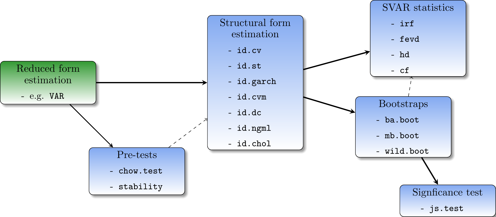
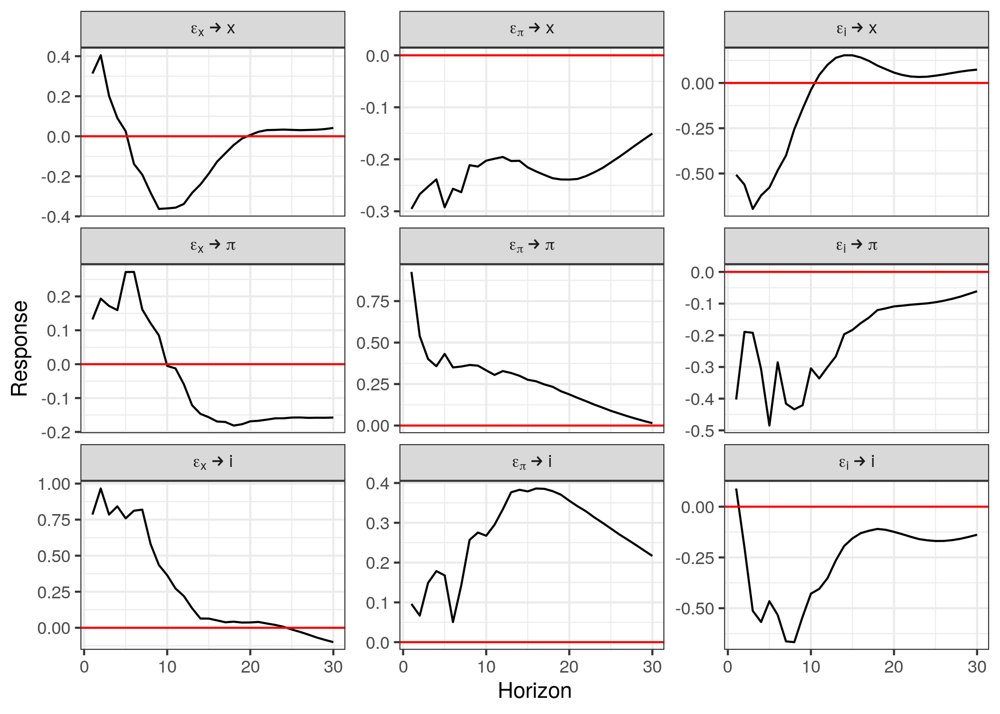
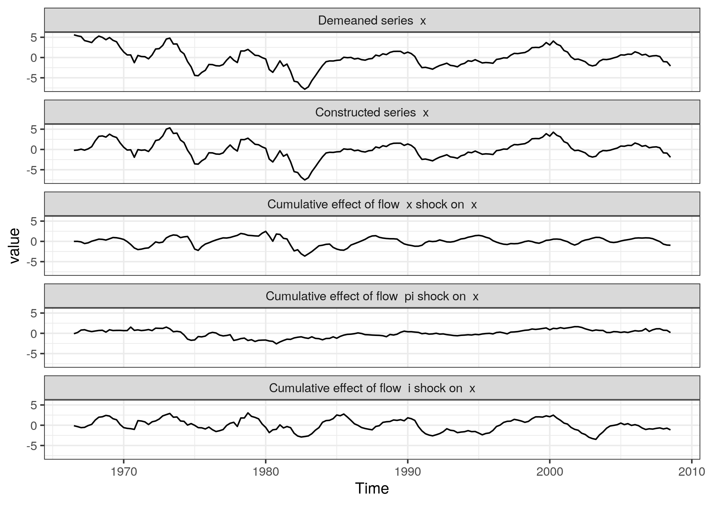
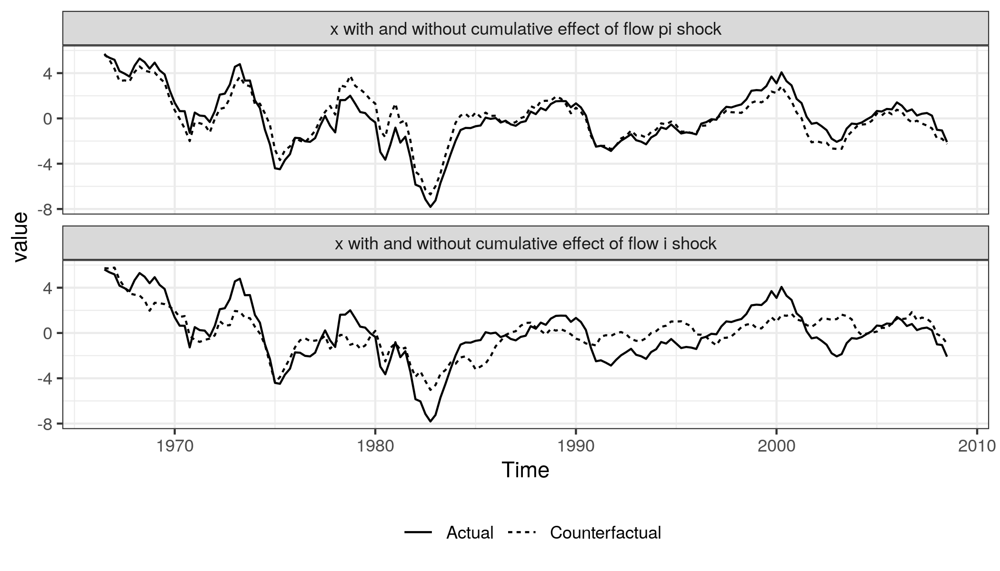

svars 
=====

[](https://travis-ci.org/alexanderlange53/svars) 
[](https://cran.r-project.org/package=svars) 
[](https://cran.r-project.org/package=svars)

Analysing causal relationships among time series in R.

## Overview

The package 'svars' contains data-driven identification methods for structural vector autoregressive (SVAR) models.
Based on an existing vector autoregression (VAR) model object (provided by e.g. VAR() from the 'vars' package), the structural matrix is obtained via data-driven identification techniques.

The cornerstone functions identify the structural errors

-   `id.cv()` by means of changes in volatility with exogenous break.
-   `id.cvm()` via least dependent innovations based on Cramer-von Mises statistic.
-   `id.dc()` via least dependent innovations based on distance covariance matrix.
-   `id.garch()` through GARCH patterns.
-   `id.ngml()` by means of non-Gaussian maximum likelihood.
-   `id.st()` by means of smooth transition in covariance.

Moreover, the classical recursive identification scheme is easy accessible via

-  `id.chol()` identification via cholesky decomposition.

These functions return an estimated svars object with identified structural shocks and decomposition of the covariance matrix of the reduced form errors. Additionally, the package contains various tools for SVAR analysis. Below find schematic overview of the package functions and how they can be used. 



## Installation

```r
install.packages("svars")
```

Alternatively, install the development version


```r
install.packages("devtools")
devtools::install_github("alexanderlange53/svars")
```


```r
library("svars")
```

## Usage

To get started, use the example data set which is included in the package. The data set consists of three U.S. macroeconomic time series, i.e. output gap (x), inflation (pi) and interest rates (r). More details on the data set are provided in the description file `?USA`.

```r
ggplot2::autoplot(USA, facet = TRUE) + ggplot2::theme_bw()
```


First, the reduced form VAR needs to be estimated, for instance using the vars package, and the user needs to store the resulting object. Subsequently, the user chooses a method from the svars package to determine the structural matrix. The choice of the method usually depends on the data structure, for more details see the help file `help(svars)`. For illustration, we use the identification by means of non-Gaussian maximum likelihood. 

```r
reduced.form <- vars::VAR(USA, lag.max = 10, ic = "AIC" )
structural.form <- id.ngml(reduced.form)
summary(structural.form)


# Identification Results
# ---------------------- 
# 
# Method: Non-Gaussian maximum likelihood
# Sample size: 169
# Log-Likelihood: -548.1502
# AIC: 1236.3
# Stage3: FALSE
# Estimated degrees of freedom:                    4.643001 5.464837 2.889977
# Standard errors of estimated degrees of freedom: 1.675499 2.399767 0.7202656
# 
# Estimated B Matrix (unique decomposition of the covariance matrix): 
#           [,1]        [,2]      [,3]
# x   0.50698224 -0.29546945 0.3133178
# pi  0.40274614  0.92602852 0.1318203
# i  -0.08952258  0.09603444 0.7849987
# 
# Estimated standardized B matrix:
#          [,1]       [,2]      [,3]
# x   1.0000000 -0.3190717 0.3991316
# pi  0.7943989  1.0000000 0.1679243
# i  -0.1765793  0.1037057 1.0000000
# 
# Standard errors of standardized B matrix:
#         [,1]       [,2]       [,3]
# x  0.0000000 0.08663002 0.09808362
# pi 0.2616619 0.00000000 0.19118413
# i  0.1264578 0.08121298 0.00000000
# 
# Estimated scale of the standardized B: 0.5069822 0.9260285 0.7849987
# Standard errors of the scale:          0.06375658 0.09693425 0.180145 
```
The summary includes general information on the estimation (see `?id.ngml`) and the decomposition of the covariance matrix which relates the reduced form errors and the structural errors. The resulting matrix represents the on impact effects of structural shocks on the variables. Since the structural matrix is only identified up to sign and permutation, the user (probably) needs to rearrange the columns to obtain a reasonable economic interpretation. As an example, we order the columns according to an economically derived sign pattern. Afterwards, we can calculate impulse response functions.

```r
structural.form$B <- structural.form$B[,c(3,2,1)]
structural.form$B[,3] <- structural.form$B[,3]*(-1)

impulse.response <- irf(structural.form, n.ahead = 30)
plot(impulse.response, scales = 'free_y')
```


It is common practice in the SVAR literature to calculate confidence bands via bootstrap procedures. The svars package contains the fixed design wild bootstrap (`wild.boot()`) and the moving block bootstrap method (`mb.boot()`). The functions allow for parallel computation on non-Windows systems. Nevertheless, bootstrapping the SVAR model is computationally demanding and - depending on the identification technique - time-consuming. Several input arguments enable to adjust the bootstrap methods to the data set (see e.g. `?wild.boot()`) and to test various hypotheses. To illustrate a simple case we use the bootstrap to calculate confidence bands only.

```r
cores <- parallel::detectCores() - 1
boot.svar <- wild.boot(structural.form, n.ahead = 30, nboot = 500, nc = cores)


plot(boot.svar)
```


Besides impulse response analysis, svars contains several tools for SVAR analysis. For instance, the forecast error variance decomposition is useful to see the contribution of each shock to the response of each variable.

```r
fevd <- fevd(structural.form, n.ahead = 30)
plot(fevd)
```


The historical decomposition allows to trace back the effects of specific structural shocks on observed recessions or booms in the series.

```r
hist.decomp <- hd(structural.form, series = 1)
plot(hist.decomp)
```



Directly related to the historical decomposition is the concept auf counterfactuals. This method allows to analyze hypothetical scenarios in which effects of specific shocks are neglected.  

```r
counterfactuals <- cf(structural.form, series = 1)
plot(counterfactuals)
```


